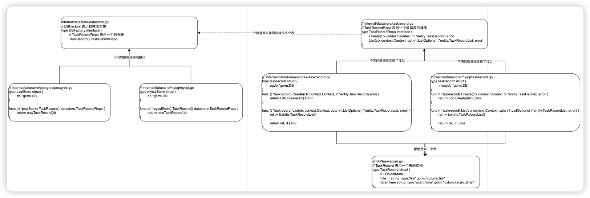
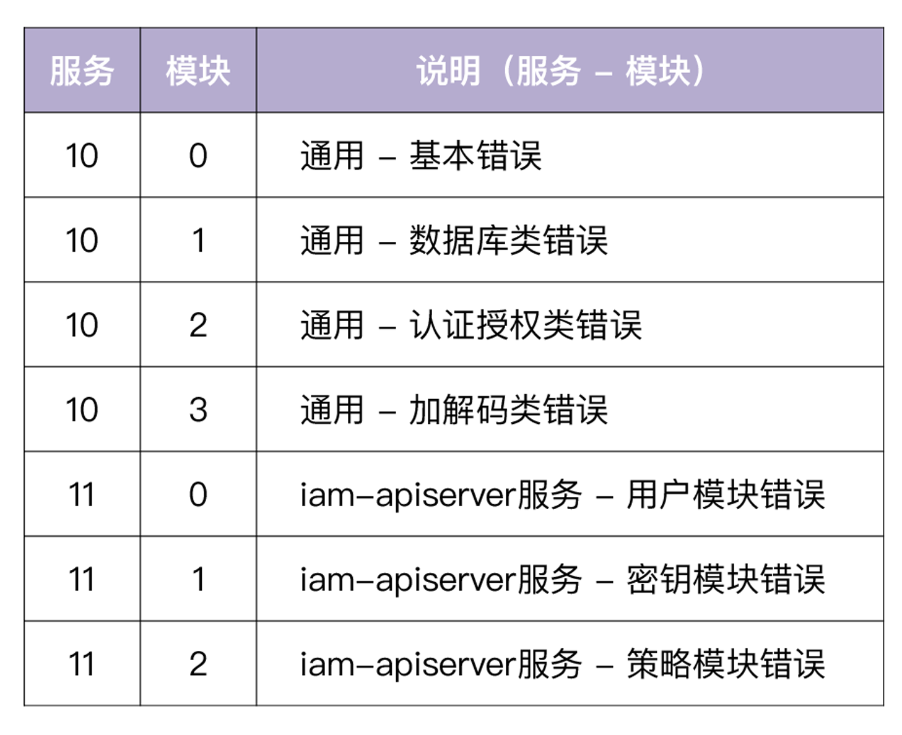
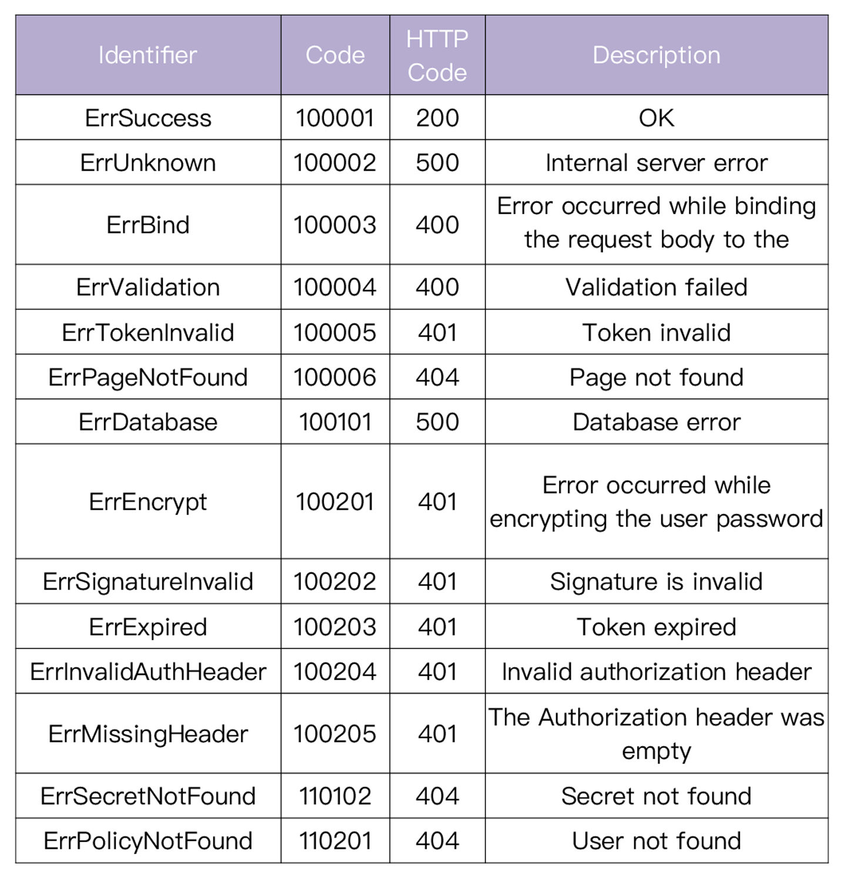

# 设计架构

- 使用工厂模式构建数据模块，将业务端与数据端完全分离
- 使用工厂模式构建上报模块，可以将内容上报到 es，redis 等

数据上报的条件：
- 批量投递：buffer 已满，马上投递
- 超时投递：只要 buffer 有数据，并且到达了投递时间，也会马上投递

工厂模式的数据架构



# 用法

**注册错误码**
1. internal/pkg/errorcode/joberror.go，修改该文件中的错误码定义，一定要注意注释要符合特定格式才能保证后续会自动化生成并将错误注册上去：// <错误码整型常量> - <对应的HTTP Status Code>: .
2. 执行下面命令生成错误码文件：
```shell
# 在目录/tools/codegen下编译 codegen 工具
go build

# 将编译后的产物 codegen 放入到bin目录中
mv codegen $GOPATH/bin/codegen

# 在项目根目录下执行 make gen 命令, 自动化生成两个文件:
- docs/guide/api/error_code_generated.md: 说明文档
- internal/pkg/errorcode/errorcode_generated.go: 错误码注册文档

```

# 错误码

* http status code：
  - 200 - 表示请求成功执行。
  - 400 - 表示客户端出问题。
    - 401 - 表示认证失败。
    - 403 - 表示授权失败。
    - 404 - 表示资源找不到，这里的资源可以是 URL 或者 RESTful 资源。
  - 500 - 表示服务端出问题。

* 三段式错误码（100001）：
  * 10：表示服务
  * 00：表示模块
  * 01：表示模块下的错误码序号，每个模块可以注册 100 个错误


* 错误码返回内容
```json
{ "code": 100101, "message": "Database error", "reference": "https://github.com/marmotedu/iam/tree/master/docs/guide/zh-CN/faq/iam-apiserver"}
```
- code 表示错误码，
- message 表示该错误的具体信息。每个错误同时也对应一个 HTTP 状态码。比如上述错误码对应了 HTTP 状态码 500(Internal Server Error)。
- reference 字段包含了可以解决这个错误的文档链接地址（对外暴露的错误说明，应该是该怎么做，而不是哪里错了）

* 在使用文档中注明错误码对应表


# 错误包使用

不需要特意为错误封装一个 struct，只需要利用好 errors.Wrap功能进行错误信息封装，主要利用以下三个函数：
- WithCode函数来创建新的 withCode 类型的错误
- WrapC来将一个 error 封装成一个 withCode 类型的错误

判断错误：
- IsCode来判断一个 error 链中是否包含指定的 code

参考下面内容
```go
package main

import (
  "fmt"

  "github.com/marmotedu/errors"
  code "github.com/marmotedu/sample-code"
)

func main() {
  if err := bindUser(); err != nil {
    // %s: Returns the user-safe error string mapped to the error code or the error message if none is specified.
    fmt.Println("====================> %s <====================")
    fmt.Printf("%s\n\n", err)

    // %v: Alias for %s.
    fmt.Println("====================> %v <====================")
    fmt.Printf("%v\n\n", err)

    // %-v: Output caller details, useful for troubleshooting.
    fmt.Println("====================> %-v <====================")
    fmt.Printf("%-v\n\n", err)

    // %+v: Output full error stack details, useful for debugging.
    fmt.Println("====================> %+v <====================")
    fmt.Printf("%+v\n\n", err)

    // %#-v: Output caller details, useful for troubleshooting with JSON formatted output.
    fmt.Println("====================> %#-v <====================")
    fmt.Printf("%#-v\n\n", err)

    // %#+v: Output full error stack details, useful for debugging with JSON formatted output.
    fmt.Println("====================> %#+v <====================")
    fmt.Printf("%#+v\n\n", err)

    // do some business process based on the error type
    if errors.IsCode(err, code.ErrEncodingFailed) {
      fmt.Println("this is a ErrEncodingFailed error")
    }

    if errors.IsCode(err, code.ErrDatabase) {
      fmt.Println("this is a ErrDatabase error")
    }

    // we can also find the cause error
    fmt.Println(errors.Cause(err))
  }
}

func bindUser() error {
  if err := getUser(); err != nil {
    // Step3: Wrap the error with a new error message and a new error code if needed.
    return errors.WrapC(err, code.ErrEncodingFailed, "encoding user 'Lingfei Kong' failed.")
  }

  return nil
}

func getUser() error {
  if err := queryDatabase(); err != nil {
    // Step2: Wrap the error with a new error message.
    return errors.Wrap(err, "get user failed.")
  }

  return nil
}

func queryDatabase() error {
  // Step1. Create error with specified error code.
  return errors.WithCode(code.ErrDatabase, "user 'Lingfei Kong' not found.")
}
```


